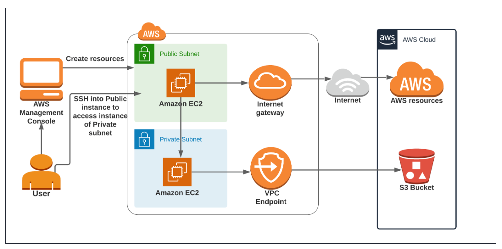

### **Desafio de Negócio**

**Dever de casa **

https://blog.intigriti.com/hacking-tools/hacking-misconfigured-aws-s3-buckets-a-complete-guide

**Desafio**: **Proteção e Processamento Seguro de Dados Sensíveis em Ambientes Regulatórios**

Em muitas indústrias, como a financeira, de saúde ou de tecnologia, as empresas lidam com grandes volumes de dados altamente sensíveis que devem ser protegidos rigorosamente para cumprir regulamentações como GDPR, HIPAA, ou normas internas de segurança. Um desafio comum é garantir que esses dados sejam processados de forma segura, sem exposição a ameaças externas, ao mesmo tempo em que permitem o acesso controlado para manutenção e monitoramento.
