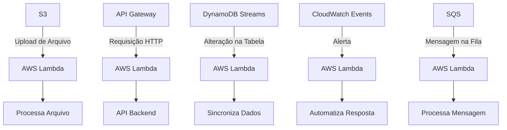

### Aula 09: AWS Lambda e Eventos na AWS

**Objetivo**: Nesta aula, exploraremos o AWS Lambda e seu papel dentro de arquiteturas serverless na AWS. Vamos entender as diferenças entre o AWS Lambda e o EC2, discutir suas vantagens e desafios, e aprender como eventos podem ser aproveitados para criar sistemas escaláveis e eficientes.

### 3. **Arquitetura Serverless com AWS Lambda**

Este diagrama mostra uma arquitetura típica serverless, onde múltiplos serviços da AWS interagem com o Lambda para automatizar processos.

### **1. Introdução ao AWS Lambda**

AWS Lambda é um serviço de computação serverless que executa código sem que você precise gerenciar servidores. Ele é ideal para processos pontuais que respondem automaticamente a eventos, como uploads no S3, alterações em bancos de dados, e requisições HTTP através do API Gateway. Embora o termo "serverless" sugira a ausência de servidores, na prática, isso significa que o código é executado em servidores gerenciados pela AWS, não por você.
